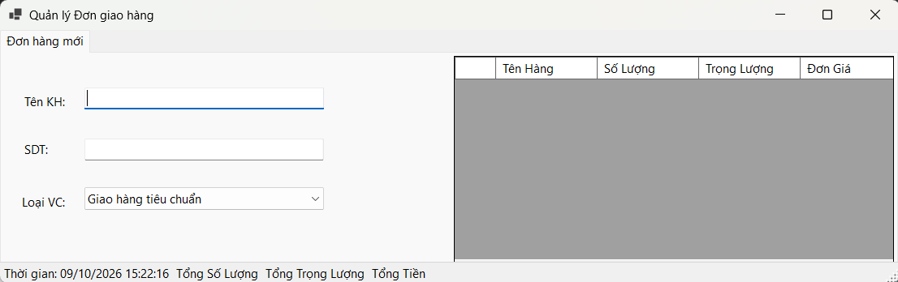
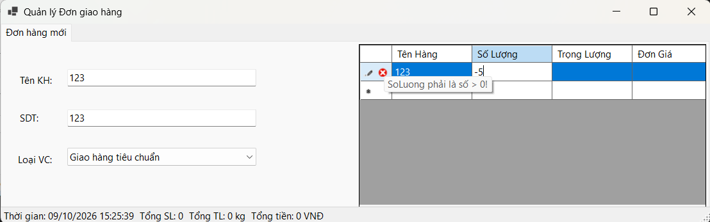
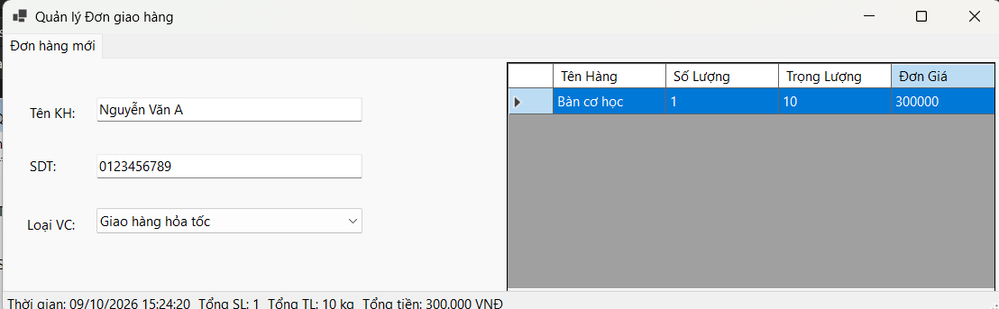

# BÁO CÁO BÀI TẬP / ĐỒ ÁN

## THÔNG TIN SINH VIÊN
- **Họ và tên:** La Nhật Nam
- **Mã số sinh viên:** 24810320300
- **Lớp:** D19QTANM1
- **Tên môn học:** Lập trình .NET/winforms
- **Tên bài tập:** Bảng điều khiển Quản lý Đơn giao hàng (Delivery Order Dashboard)

## KẾT QUẢ THỰC HÀNH

### 1. Ảnh màn hình Giao diện chính

### 2. Ảnh màn hình Chức năng thực thi / Kết quả

